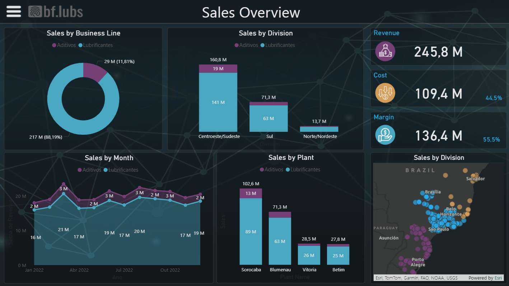
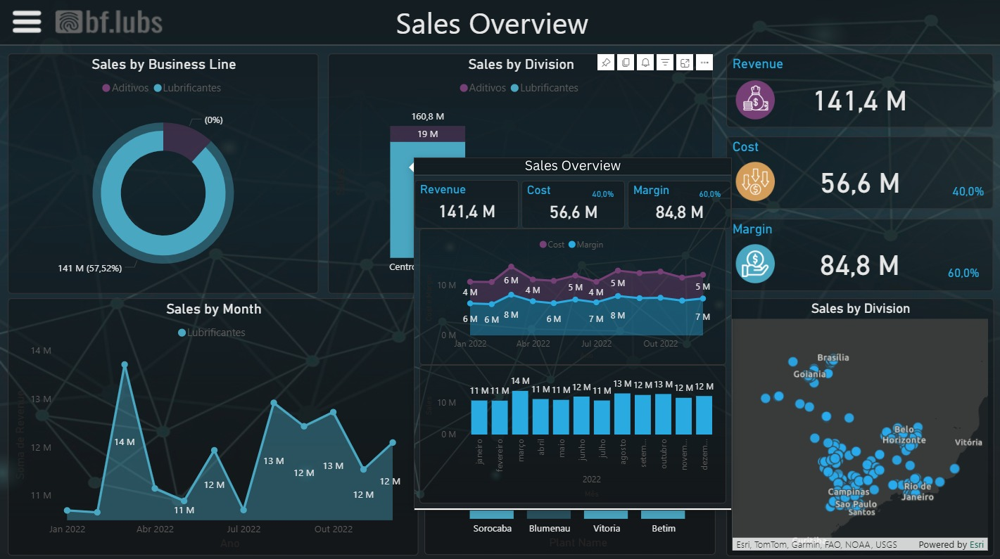
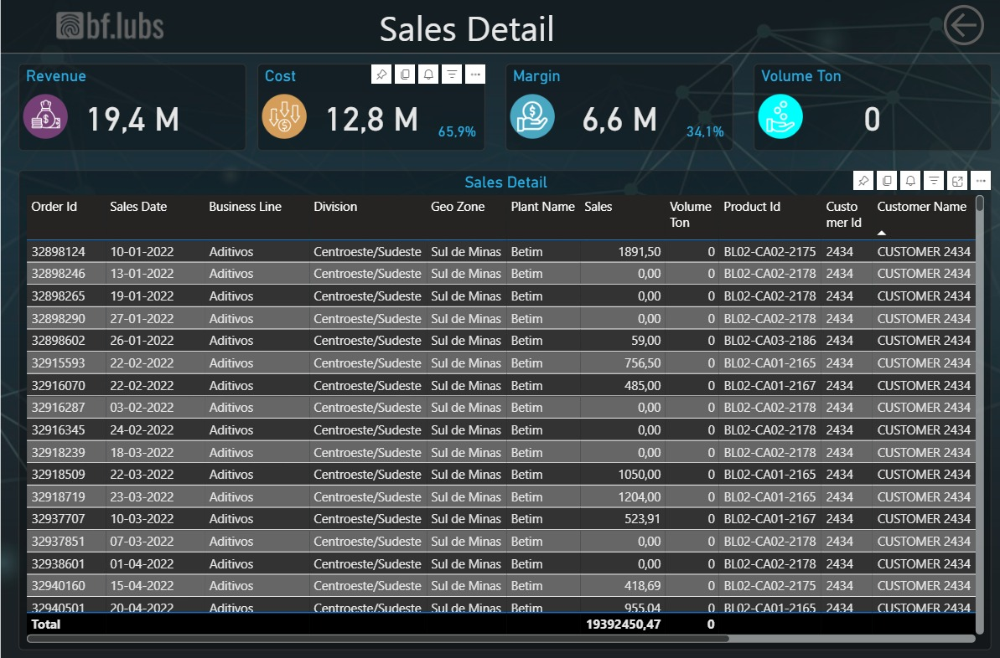

# 📊 Sales Overview Dashboard (Power BI)

## 🧠 Contexto do Projeto
Este projeto foi desenvolvido como parte do processo de aprendizado em **Power BI e análise de dados**, com foco na construção de dashboards analíticos voltados para **acompanhamento de desempenho de vendas**.

O objetivo principal foi consolidar conceitos de:
- Modelagem de dados
- Criação de medidas em DAX
- Visualização de indicadores financeiros
- Storytelling com dashboards

---

## 🎯 Objetivo de Negócio
Fornecer uma visão geral e interativa das vendas, permitindo responder perguntas como:
- Qual o faturamento total e a margem do negócio?
- Como as vendas se distribuem por linha de negócio, divisão e planta?
- Qual o comportamento das vendas ao longo do tempo?
- Quais segmentos apresentam melhor desempenho?

---

## 📌 Principais Indicadores
- **Revenue**
- **Cost**
- **Margin**

---

## 📈 Visuais do Dashboard

### Visão Geral

- Sales by **Business Line**
- Sales by **Division**
- Sales by **Month**
- Sales by **Plant**

### Tooltip Interativa

### Detalhamento de Vendas

---

## 🛠️ Ferramentas Utilizadas
- Power BI Desktop
- Power Query
- DAX

## 📎 Observações Técnicas
- O dashboard foi publicado na versão web do Power BI. [Acessar dashboard publicado (Power BI Service)](https://app.powerbi.com/view?r=eyJrIjoiNDhmZjFmZmMtMjU5Zi00YWE1LTlmZmYtZGJmNzU1Yzk5ZmQ0IiwidCI6IjY1OWNlMmI4LTA3MTQtNDE5OC04YzM4LWRjOWI2MGFhYmI1NyJ9)
- Devido a limitações de tamanho do GitHub, os arquivos `.pbix` e a base completa em Excel não estão versionados neste repositório.

## 🗂️ Estrutura do Repositório
- `/images` – Prints do dashboard

## 🚀 Próximos Passos
Este projeto serviu como base para o desenvolvimento de dashboards de vendas mais avançados, com foco em análises mais complexas e problemas reais de negócio.
